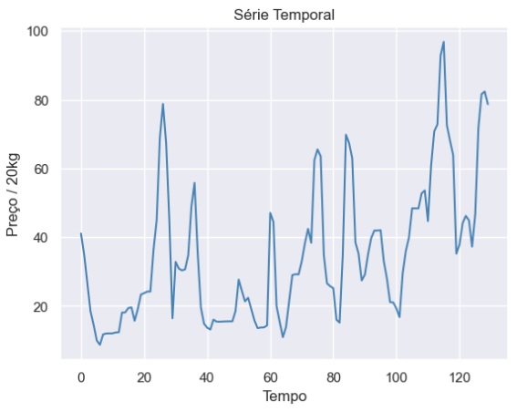
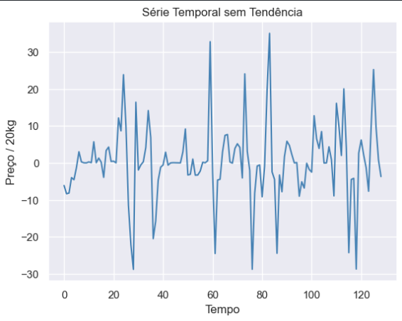

# EDA - Abordagem Temporal

## Coleta de dados:
Realizei um webscraping simples já que os dados estavam expostos na página. Para isso utilizei as bibliotecas:
- Requests
- BeautfulSoup

## Limpeza dos dados:
Na limpeza e preparação dos dados houveram dois problemas principais:
- Dados faltantes;
- Tipo dos dados;

### Tratando dados faltantes: 
Para realizar o tratamento de dados faltantes em uma abordagem de séries temporais existem muitas abordagens, que devem levar em conta o problema em questão, e seu contexto. Nesse caso, haviam muitos dados ausentes em sequência e esses dados eram muito antigos, resolvi remove-los. Porém, existiam outros dados ausentes que não os mencionados anteriormente. Esses eu resolvi preenche-los usando o KNNinputer, um método da biblioteca Skitlearn.
```python
from sklearn.impute import KNNImputer

# Separando os recursos e o alvo
X = df.drop(columns=['time'])
y = df['precos_nacionais']

#Instanciando o modelo de inputação e definindo a quantidade de vizinhos
imputer = KNNImputer(n_neighbors=2)  

# Treinando o imputador KNN e transformando os dados
X_imputed = imputer.fit_transform(X)

# Convertendo a matriz numpy de volta para DataFrame
df_imputed = pd.DataFrame(X_imputed, columns=X.columns)

# Adicionando a coluna de tempo de volta ao DataFrame
df_imputed['time'] = df['time']
df_imputed[df_imputed['time']=='2016-03-01']
```

### Tipo dos dados:
Um problema muito comum quando se trata de dados que envolvem datas, é que esses dados venham interpretados como objeto, o que não é interessante para os modelos e as análises matemáticas, por isso os converti para datetime.
```python
df['time'] = pd.to_datetime(df['time'], format='%m/%Y')
```

## Análise da Série:



Como toda série temporal, temos 3 componentes que a constituem:
$$X_t = S + T + \epsilon$$
Onde:

$S:\text{ sazonalidade}$

$T:\text{ tendência}$

$\epsilon:\text{ ruído}$

### Tendência:
Realizei o teste Cox-Stuart com uma implementação em SCRATCH, para verificar a presença de tendência, trabalhando com o p-vlaue de 0,05. 
```python
def simpleCS (x, trend_type = "l"):
    n0 = len(x)%2
    if n0 == 1:
        remover = int((len(x))/2)
        x = np.delete(x, int((len(x))/2))
        
    half = len(x)/2
    
    x1 = x[np.arange(0, half, dtype=int)]
    x2 = x[np.arange(half, len(x), dtype=int)]
    
    n = np.sum((x2 - x1) != 0)
    t = np.sum(x1 < x2)
    
    if trend_type == "l":
        pvalue = stats.binom.cdf(t, n, 0.5)
    else:
        pvalue = 1 - stats.binom.cdf(t - 1, n, 0.5)
    
    return pvalue
```
Obtendo os resultados:  
Tendnecia Positiva: 0.999974576164756  
Tendencia Negativa:  7.605328792403832e-05  
Ou seja, temos uma tendência negativa na nossa série!

### Sazonalidade:
Para verificar a presença da sazonalidade, primeiramente, removi a tendência da série, para que a sazonalidade não fosse "mascarada".

```python
no_trend_x = np.diff(x)
```


Agora podemos realizar o teste Kruskal-Walls para verificação da sazonalidade, com uma implementação também por scratch.
```python
def simpleKW (y, freq = 12):    
    Rank = np.array(pd.Series(y).rank(method='average', na_option='keep'))
    extra = freq - len(Rank)%freq
    dat = np.concatenate((np.repeat(np.nan, extra), Rank))
    yMAT = dat.reshape((int(len(dat)/freq), freq))
    Nobs = np.apply_along_axis(lambda x: np.count_nonzero(~np.isnan(x)), 0, yMAT)
    R2n = np.power(np.apply_along_axis(np.nansum, 0, yMAT), 2)/Nobs
    H = 12/(sum(Nobs) * (sum(Nobs) + 1)) * sum(R2n) - 3 * (sum(Nobs) + 1)

    if sum(np.unique(Rank, return_counts=True)[1]>1) > 0:
        valor = np.unique(Rank, return_counts=True)[1]
        valor = valor[valor > 1]
        sumT = sum(np.power(valor, 3) - valor)
        Correction = 1 - sumT/(np.power(len(y),3) - len(y))
        H = H/Correction

    return 1 - chi2.cdf(H, freq-1)
```
Obtive os seguintes resultados:  
0.016325416829300665 5  
0.01975392997899994 11  
0.047608842916303185 23  
0.049537236706032495 33  
Sendo o número inteiro que aparece ao lado do p-valor, a frequência correspondente.

## Insights:
Nesse ponto é importante que fique claro o que estamos fazendo e o que todos esses resultados expressam:
- Há tendência (negativa).
- Há sazonalidade e sua frequência parece ser 5 ou 11 meses;  

Seria de grande importância reunir-se com pessoas da área de negocíos e discutir esses resultados. 
- Uma frequência de 5 ou 11 meses faz sentido? 
    - Se não, o que me fez chegar nessa conclusão errada? Ruído demais?  
- Houveram eventos exôgenos durante esse tempo?  

Também é válido que seja passado para o time a presença dos dados ausentes, para que esse problema não chegue em produção e possamos discutir outro métodos além dos utilizados aqui para realizar o preenchimento.