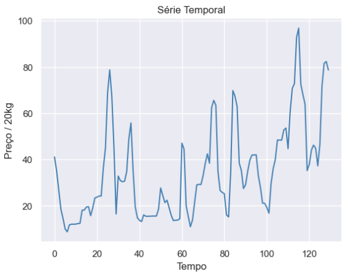
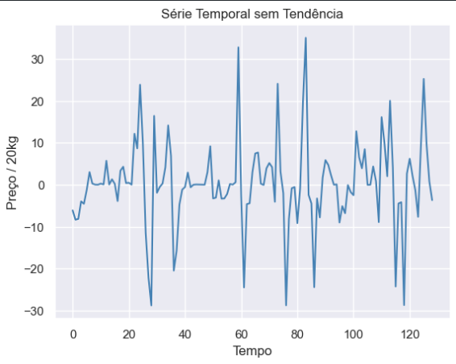

# Análise de Pricing - Uma modelagem temporal

## Project overview:
O projeto consiste-se em uma análise do mercado de produção agrícola da cebola, por meio da análise de uma série temporal do seu preço. Para realizar essa análise foram utilizadas técnicas de coleta de dados, limpeza de dados, análise de componentes da série, criação de modelos preditivos e validação dos modelos. Vale ressaltar que a proposta desse projeto não é realizar a melhor predição possível do preço, mas, analisar e gerar insights a partir dos dados. Para predição seria, talvez, mais válido a utilização de redes neurais e técnicas mais avançadas, caso tenha alguma sugestão, seria uma valiosa compartilhação.

## Fonte de Dados:
Os dados foram retirados de uma página que apresenta a cotação da cebola mensalmente, seu endereço segue abaixo:

https://www.agrolink.com.br/cotacoes/diversos/cebola/

## Coleta de dados:
Realizei um webscraping simples já que os dados estavam expostos na página. Para isso utilizei as bibliotecas:
- Requests
- BeautfulSoup

## Limpeza dos dados:
Na limpeza e preparação dos dados houveram dois problemas principais:
- Dados faltantes;
- Tipo dos dados;

### Tratando dados faltantes: 
Para realizar o tratamento de dados faltantes em uma abordagem de séries temporais existem muitas abordagens, que devem levar em conta o problema em questão, e seu contexto. Nesse caso, haviam muitos dados ausentes em sequência e esses dados eram muito antigos, resolvi remove-los. Porém, existiam outros dados ausentes que não os mencionados anteriormente. Esses eu resolvi preenche-los usando o KNNinputer, um método da biblioteca Skitlearn.
```python
from sklearn.impute import KNNImputer

# Separando os recursos e o alvo
X = df.drop(columns=['time'])
y = df['precos_nacionais']

#Instanciando o modelo de inputação e definindo a quantidade de vizinhos
imputer = KNNImputer(n_neighbors=2)  

# Treinando o imputador KNN e transformando os dados
X_imputed = imputer.fit_transform(X)

# Convertendo a matriz numpy de volta para DataFrame
df_imputed = pd.DataFrame(X_imputed, columns=X.columns)

# Adicionando a coluna de tempo de volta ao DataFrame
df_imputed['time'] = df['time']
df_imputed[df_imputed['time']=='2016-03-01']
```

### Tipo dos dados:
Um problema muito comum quando se trata de dados que envolvem datas, é que esses dados venham interpretados como objeto, o que não é interessante para os modelos e as análises matemáticas, por isso os converti para datetime.
```python
df['time'] = pd.to_datetime(df['time'], format='%m/%Y')
```
## Análise Estatística Descritiva:


## Análise da Série:



Como toda série temporal, temos 3 componentes que a constituem:
$$X_t = S + T + \epsilon$$
Onde:

$S:\text{ sazonalidade}$

$T:\text{ tendência}$

$\epsilon:\text{ ruído}$

### Tendência:
Realizei o teste Cox-Stuart com uma implementação em SCRATCH, para verificar a presença de tendência, trabalhando com o p-vlaue de 0,05. 
```python
def simpleCS (x, trend_type = "l"):
    n0 = len(x)%2
    if n0 == 1:
        remover = int((len(x))/2)
        x = np.delete(x, int((len(x))/2))
        
    half = len(x)/2
    
    x1 = x[np.arange(0, half, dtype=int)]
    x2 = x[np.arange(half, len(x), dtype=int)]
    
    n = np.sum((x2 - x1) != 0)
    t = np.sum(x1 < x2)
    
    if trend_type == "l":
        pvalue = stats.binom.cdf(t, n, 0.5)
    else:
        pvalue = 1 - stats.binom.cdf(t - 1, n, 0.5)
    
    return pvalue
```
Obtendo os resultados:  
Tendnecia Positiva: 0.999974576164756  
Tendencia Negativa:  7.605328792403832e-05  
Ou seja, temos uma tendência negativa na nossa série!

### Sazonalidade:
Para verificar a presença da sazonalidade, primeiramente, removi a tendência da série, para que a sazonalidade não fosse "mascarada".

```python
no_trend_x = np.diff(x)
```


Agora podemos realizar o teste Kruskal-Walls para verificação da sazonalidade, com uma implementação também por scratch.
```python
def simpleKW (y, freq = 12):    
    Rank = np.array(pd.Series(y).rank(method='average', na_option='keep'))
    extra = freq - len(Rank)%freq
    dat = np.concatenate((np.repeat(np.nan, extra), Rank))
    yMAT = dat.reshape((int(len(dat)/freq), freq))
    Nobs = np.apply_along_axis(lambda x: np.count_nonzero(~np.isnan(x)), 0, yMAT)
    R2n = np.power(np.apply_along_axis(np.nansum, 0, yMAT), 2)/Nobs
    H = 12/(sum(Nobs) * (sum(Nobs) + 1)) * sum(R2n) - 3 * (sum(Nobs) + 1)

    if sum(np.unique(Rank, return_counts=True)[1]>1) > 0:
        valor = np.unique(Rank, return_counts=True)[1]
        valor = valor[valor > 1]
        sumT = sum(np.power(valor, 3) - valor)
        Correction = 1 - sumT/(np.power(len(y),3) - len(y))
        H = H/Correction

    return 1 - chi2.cdf(H, freq-1)
```
Obtive os seguintes resultados:  
0.016325416829300665 5  
0.01975392997899994 11  
0.047608842916303185 23  
0.049537236706032495 33  
Sendo o número inteiro que aparece ao lado do p-valor, a frequência correspondente.

## Insights:
Nesse ponto é importante que fique claro o que estamos fazendo e o que todos esses resultados expressam:
- Há tendência (negativa).
- Há sazonalidade e sua frequência parece ser 5 ou 11 meses;  

Seria de grande importância reunir-se com pessoas da área de negocíos e discutir esses resultados. 
- Uma frequência de 5 ou 11 meses faz sentido? 
    - Se não, o que me fez chegar nessa conclusão errada? Ruído demais?  
- Houveram eventos exôgenos durante esse tempo?  

Também é válido que seja passado para o time a presença dos dados ausentes, para que esse problema não chegue em produção e possamos discutir outro métodos além dos utilizados aqui para realizar o preenchimento.